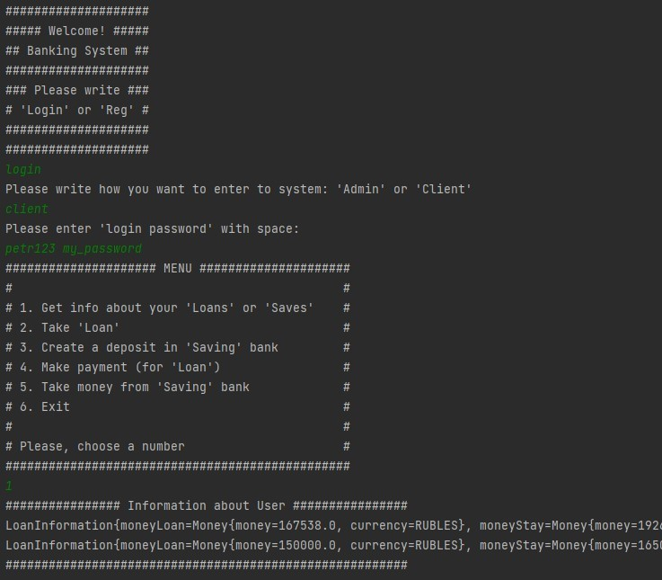

# MultiThread-SocketServer-Banks

## About

The server package implements the functionality of a multithreaded socket server (by default, the server is created locally on the computer and listens on port 8080).
The "client" package implements the functionality of a user who can connect to the server.
When connecting, a session is created between the server and the client, and then you can use various functions of the banking system by entering into the console.
The server uses its own [API of the banking system](https://github.com/trofik00777/Banking-System-API).

## Build and run

You can download project to you PC and build a project using `maven`

## Example of work

